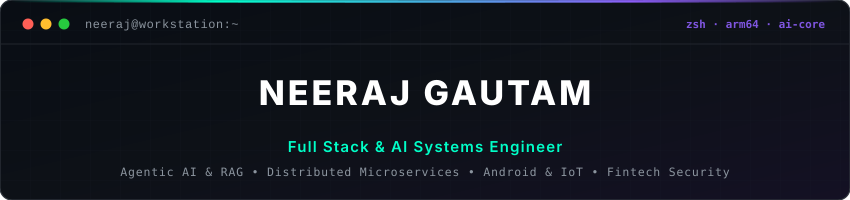
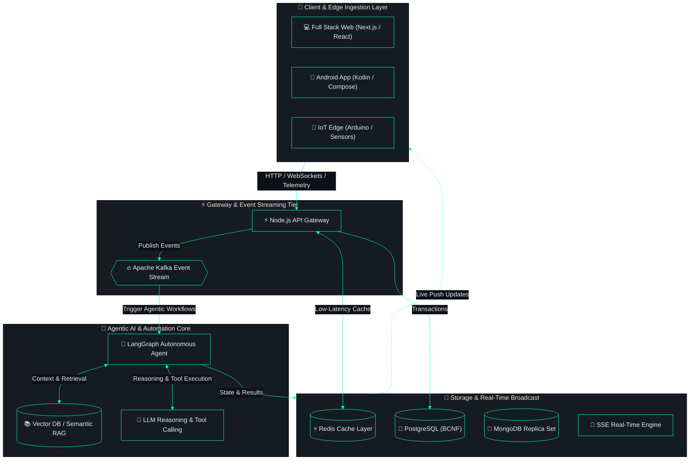

<div align="center">



<br>

[](https://git.io/typing-svg)

<p align="center">
  <a href="https://www.linkedin.com/in/neeraj-gautam-b86188251" target="_blank"></a>
  <a href="mailto:gautamneeraj014@gmail.com"></a>
  
  <a href="#-featured-proof-of-work"></a>
  <a href="#-technical-arsenal"></a>
</p>

</div>

---

### ⚡ Executive Overview

```bash
neeraj@workstation:~$ whoami --verbose
```
```json
{
  "name": "Neeraj Gautam",
  "role": "Full Stack & AI Systems Engineer",
  "core_focus": [
    "Agentic AI Workflows & RAG Pipelines (LangGraph · LangChain · Vector DBs)",
    "Full Stack & Distributed Architectures (Next.js · Node.js · Kafka · Redis)",
    "Fintech Reliability & Security (BCNF Normalization · CPT Certified · CVE Remediator)"
  ],
  "extended_capabilities": [
    "Mobile Engineering (Kotlin · Jetpack Compose · MVVM Clean Architecture)",
    "IoT & Edge Hardware (Arduino · ESP32 · Sensor Arrays · Telemetry)"
  ],
  "security_profile": "Patched Critical CVE GHSA-9qr9-h5gf-34mp in production",
  "environment": "macOS M4 + Kali Linux (Pi 5) · Neovim (Lua, 50+ plugins) · Rootless Podman"
}
```

---

### 🧩 System Architecture in Action

*End-to-end event-driven architecture coordinating full-stack clients, agentic AI workflows, and distributed storage:*



---

### 🛠 Technical Arsenal

<div align="center">

<p align="center">
  
</p>

<br>

**· 🧠 Agentic AI & Intelligence ·**


**· ⚡ Full Stack & Distributed Systems ·**


**· 📱 Mobile & IoT Hardware (Versatility) ·**


**· 🛡️ DevOps, Security & Developer Velocity ·**


</div>

<br>

| Capability Layer | Stack & Tools | Applied Engineering Focus |
| :--- | :--- | :--- |
| **Agentic AI & LLMs** | LangGraph, LangChain, RAG, Vector Stores, OpenAI / Claude / Gemini APIs | Autonomous tool-calling agents, stateful reasoning graphs, semantic document retrieval |
| **Full Stack & Distributed** | Node.js, Express, Next.js, React, Kafka, Redis, PostgreSQL, MongoDB | Event streaming, sub-50ms caching, microservices, BCNF data normalization |
| **Client & Edge Versatility** | Kotlin, Jetpack Compose, Arduino, ESP32, Sensor Arrays | Reactive mobile UIs, sensor telemetry streams, hardware-to-cloud bridges |
| **DevOps & Security** | CPT Certified, Podman, Docker, Linux, GitHub Actions, Neovim (Lua) | Production CVE remediation, threat modeling, rootless containers, terminal velocity |

---

### 🚀 Featured Proof-of-Work

<details open>
<summary><b>🛡️ FormBuilder & Microservices Platform (Enterprise Full Stack)</b></summary>
<br>

> High-throughput enterprise platform coordinating dynamic forms, event-driven workflows, AI-assisted reporting, and production security remediation.

- **Stack:** Node.js · Next.js · Apache Kafka · Redis · MongoDB Replica Set · Podman
- **Engineering Highlights:**
  - Event-driven notifications orchestrated via Apache Kafka and RxJS over Server-Sent Events (SSE).
  - Remediated critical Remote Code Execution vulnerability (`GHSA-9qr9-h5gf-34mp`) in production Next.js dependencies.
  - Containerized with rootless Podman on enterprise Linux infrastructure.
- **Status:** `Office Work (Proprietary)`

</details>

<details>
<summary><b>🤖 Agentic AI & Workflow Automation Engine (AI Systems)</b></summary>
<br>

> Autonomous multi-step task execution engine utilizing stateful agent graphs, tool execution, and semantic RAG retrieval.

- **Stack:** LangGraph · LangChain · Python / Node.js · Vector DB · LLM Function Calling
- **Engineering Highlights:**
  - Stateful graph orchestration handling complex multi-agent workflows with human-in-the-loop validation.
  - Semantic RAG pipeline with dense vector indexing, hybrid keyword search, and contextual reranking.
  - Autonomous tool-calling integrations automating data ingestion, report generation, and third-party APIs.
- **Status:** `Architecture & Production Workflows`

</details>

<details open>
<summary><b>🔥 DSA Mastery — Interactive Algorithm Visualizer (Open Source)</b></summary>
<br>

> Interactive computer science platform visualizing 190+ data structures and algorithms with real-time canvas state machines.

- **Stack:** React · D3.js · Vite · GitHub Pages
- **Engineering Highlights:** Custom canvas animation pipeline, algorithmic step-by-step state machine, zero heavy UI framework bloat.
- **Links:** [🌐 Live Demo](https://gautamneeraj88.github.io/dsa-mastery) · [💻 GitHub Repository](https://github.com/Gautamneeraj88/dsa-mastery)

</details>

<details>
<summary><b>🌾 Grain Quality Monitor & Telemetry System (IoT & Edge)</b></summary>
<br>

> Automated physical measurement and environmental telemetry system bridging custom hardware sensors with cloud dashboards.

- **Stack:** Arduino · Sensor Array · FastAPI · MongoDB · Web Dashboard
- **Engineering Highlights:**
  - Multi-sensor array collecting optical, moisture, and density metrics from physical grain samples.
  - Hardware-to-cloud telemetry pipeline pushing serial data through an automated ingestion API.
  - Real-time calibration curves and quality grading algorithms.
- **Status:** `Hardware & Software System`

</details>

<details>
<summary><b>📱 Bank On The Go — Android Banking Client (Mobile & Fintech)</b></summary>
<br>

> Mobile banking application built with modern Android guidelines, focusing on banking-grade security and instant transaction updates.

- **Stack:** Kotlin · Jetpack Compose · MVVM · Clean Architecture · PostgreSQL · SSE
- **Engineering Highlights:**
  - Unidirectional Data Flow (UDF) with Compose and Coroutines/StateFlow.
  - BCNF normalized schema via Prisma + PostgreSQL for strict transaction consistency.
  - Real-time balance and transaction push alerts via SSE.
- **Status:** `Office Work (Proprietary)`

</details>

<details>
<summary><b>⚡ Neovim Configuration — Ultimate Terminal Development Environment</b></summary>
<br>

> Fully modular Lua-based Neovim configuration built for blazing-fast full-stack, AI, and systems engineering.

- **Stack:** Lua · Neovim 0.10+ · Treesitter · Mason · Telescope · LSP Zero
- **Features:** 50+ plugins, sub-40ms startup time, unified theme, customized keymaps.
- **Links:** [💻 GitHub Repository](https://github.com/Gautamneeraj88/nvim-config)

</details>

---

### 📈 Activity & Stats

<div align="center">


</div>

#### ⚡ Recent Activity
<!--START_SECTION:activity-->
- ⚡ Pushed 1 commit to [Gautamneeraj88/Gautamneeraj88](https://github.com/Gautamneeraj88/Gautamneeraj88) — *Sep 8, 2026*
- 🌱 Created branch `fix/keymap-and-plugin-cleanup` in [Gautamneeraj88/nvim-config](https://github.com/Gautamneeraj88/nvim-config) — *Aug 25, 2026*
<!--END_SECTION:activity-->

---

<div align="center">

```bash
$ echo "Let's connect: Full Stack · Agentic AI · Distributed Systems · Security Research"
```

[](https://www.linkedin.com/in/neeraj-gautam-b86188251)
[](https://github.com/Gautamneeraj88)
[](mailto:gautamneeraj014@gmail.com)

```
neeraj@gautam:~$ █
```

</div>
