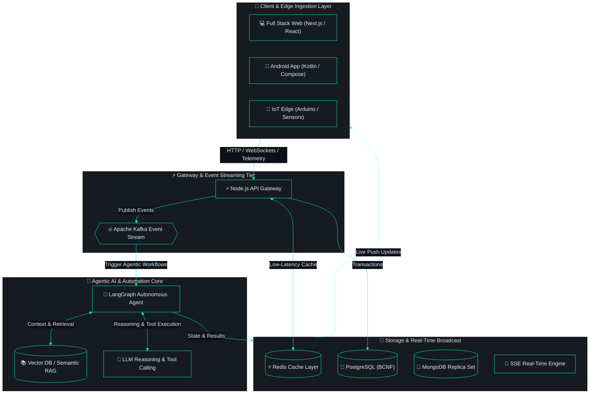

<p align="center">
  
</p>

<p align="center">
  
</p>

---

## 🎯 About Me

<table>
<tr>
<td width="58%" valign="top">

```typescript
const neeraj = {
    role: "Full Stack & AI Systems Engineer",
    location: "India 🇮🇳",

    building: [
        "Agentic AI & RAG Workflows",
        "High-Throughput Distributed Microservices",
        "Interactive Web Applications (Next.js)"
    ],

    learning: [
        "Advanced Multi-Agent Architectures (LangGraph)",
        "Distributed Systems & Consensus",
        "IoT Edge Hardware Telemetry"
    ],

    tech: {
        fullstack: ["Next.js", "React", "Node.js", "TypeScript", "Express"],
        ai_and_rag: ["LangGraph", "LangChain", "Vector DBs", "LLM Tool Calling"],
        systems: ["Apache Kafka", "Redis", "PostgreSQL (BCNF)", "MongoDB"],
        versatility: ["Android (Compose)", "IoT (Arduino/ESP32)", "Podman", "Neovim"]
    }
};
```

<br>


</td>

<td width="42%" align="center">


</td>
</tr>
</table>

<br>

## 🌐 Connect with Me

<p align="center">
  <a href="https://www.linkedin.com/in/neeraj-gautam-b86188251" target="_blank">
    
  </a>
  &nbsp;
  <a href="https://github.com/Gautamneeraj88" target="_blank">
    
  </a>
  &nbsp;
  <a href="mailto:gautamneeraj014@gmail.com">
    
  </a>
  &nbsp;
  <a href="#-featured-projects">
    
  </a>
  &nbsp;
  <a href="#-tech-arsenal">
    
  </a>
</p>

<br>

## 🛠️ Tech Arsenal

<table align="center" width="100%">
<tr>

<!-- LEFT COLUMN -->
<td width="50%" align="center" valign="top">

<h3>🎨 Frontend & Full Stack</h3>

<p align="center">
  
</p>

<br>

<h3>⚙️ Backend & Distributed Systems</h3>

<p align="center">
  
</p>

<p align="center">
  
  
</p>

<br>

<h3>🤖 Agentic AI & Intelligence</h3>

<p align="center">
  
</p>

<p align="center">
  
  
  
  
  
</p>

</td>

<!-- RIGHT COLUMN -->
<td width="50%" align="center" valign="top">

<h3>📱 Mobile & IoT Hardware</h3>

<p align="center">
  
</p>

<p align="center">
  
  
</p>

<br>

<h3>🛡️ Security & Dev Velocity</h3>

<p align="center">
  
</p>

<p align="center">
  
  
  
  
</p>

</td>

</tr>
</table>

<br>

## 🧩 System Architecture in Action



<br>

## 🚀 Featured Projects

<details open>
<summary><b>🛡️ FormBuilder & Microservices Platform (Enterprise Full Stack)</b></summary>
<br>

> High-throughput enterprise platform coordinating dynamic forms, event-driven workflows, AI-assisted reporting, and production security remediation.

- **Stack:** Node.js · Next.js · Apache Kafka · Redis · MongoDB Replica Set · Podman
- **Engineering Highlights:**
  - Event-driven notifications orchestrated via Apache Kafka and RxJS over Server-Sent Events (SSE).
  - Remediated critical Remote Code Execution vulnerability (`GHSA-9qr9-h5gf-34mp`) in production Next.js dependencies.
  - Containerized with rootless Podman on enterprise Linux infrastructure.
- **Status:** `Office Work (Proprietary)`

</details>

<details>
<summary><b>🤖 Agentic AI & Workflow Automation Engine (AI Systems)</b></summary>
<br>

> Autonomous multi-step task execution engine utilizing stateful agent graphs, tool execution, and semantic RAG retrieval.

- **Stack:** LangGraph · LangChain · Python / Node.js · Vector DB · LLM Function Calling
- **Engineering Highlights:**
  - Stateful graph orchestration handling complex multi-agent workflows with human-in-the-loop validation.
  - Semantic RAG pipeline with dense vector indexing, hybrid keyword search, and contextual reranking.
  - Autonomous tool-calling integrations automating data ingestion, report generation, and third-party APIs.
- **Status:** `Architecture & Production Workflows`

</details>

<details open>
<summary><b>🔥 DSA Mastery — Interactive Algorithm Visualizer (Open Source)</b></summary>
<br>

> Interactive computer science platform visualizing 190+ data structures and algorithms with real-time canvas state machines.

- **Stack:** React · D3.js · Vite · GitHub Pages
- **Engineering Highlights:** Custom canvas animation pipeline, algorithmic step-by-step state machine, zero heavy UI framework bloat.
- **Links:** [🌐 Live Demo](https://gautamneeraj88.github.io/dsa-mastery) · [💻 GitHub Repository](https://github.com/Gautamneeraj88/dsa-mastery)

</details>

<details>
<summary><b>🌾 Grain Quality Monitor & Telemetry System (IoT & Edge)</b></summary>
<br>

> Automated physical measurement and environmental telemetry system bridging custom hardware sensors with cloud dashboards.

- **Stack:** Arduino · Sensor Array · FastAPI · MongoDB · Web Dashboard
- **Engineering Highlights:**
  - Multi-sensor array collecting optical, moisture, and density metrics from physical grain samples.
  - Hardware-to-cloud telemetry pipeline pushing serial data through an automated ingestion API.
  - Real-time calibration curves and quality grading algorithms.
- **Status:** `Hardware & Software System`

</details>

<details>
<summary><b>📱 Bank On The Go — Android Banking Client (Mobile & Fintech)</b></summary>
<br>

> Mobile banking application built with modern Android guidelines, focusing on banking-grade security and instant transaction updates.

- **Stack:** Kotlin · Jetpack Compose · MVVM · Clean Architecture · PostgreSQL · SSE
- **Engineering Highlights:**
  - Unidirectional Data Flow (UDF) with Compose and Coroutines/StateFlow.
  - BCNF normalized schema via Prisma + PostgreSQL for strict transaction consistency.
  - Real-time balance and transaction push alerts via SSE.
- **Status:** `Office Work (Proprietary)`

</details>

<details>
<summary><b>⚡ Neovim Configuration — Ultimate Terminal Development Environment</b></summary>
<br>

> Fully modular Lua-based Neovim configuration built for blazing-fast full-stack, AI, and systems engineering.

- **Stack:** Lua · Neovim 0.10+ · Treesitter · Mason · Telescope · LSP Zero
- **Features:** 50+ plugins, sub-40ms startup time, unified theme, customized keymaps.
- **Links:** [💻 GitHub Repository](https://github.com/Gautamneeraj88/nvim-config)

</details>

<br>

## 📊 GitHub Analytics

<p align="center">
  
</p>

<p align="center">
  
  
</p>

<p align="center">
  
  
</p>

<p align="center">
  
</p>

#### ⚡ Recent Activity
<!--START_SECTION:activity-->
- ⚡ Pushed 1 commit to [Gautamneeraj88/Gautamneeraj88](https://github.com/Gautamneeraj88/Gautamneeraj88) — *Sep 8, 2026*
- 🌱 Created branch `fix/keymap-and-plugin-cleanup` in [Gautamneeraj88/nvim-config](https://github.com/Gautamneeraj88/nvim-config) — *Aug 25, 2026*
<!--END_SECTION:activity-->

<br>

## 📋 GitHub Profile Summary

<p align="center">
  
</p>

<br>

<p align="center">
  
  &nbsp;&nbsp;&nbsp;&nbsp;
  
  &nbsp;&nbsp;&nbsp;&nbsp;
  
</p>

<p align="center">
  ⭐ <b>Connect with <a href="https://github.com/Gautamneeraj88">Neeraj Gautam</a></b> ⭐
</p>

<p align="center">
  <i>"Turning ideas into resilient, intelligent systems — one commit at a time!"</i> 🚀
</p>

---

<p align="center">
  <code>neeraj@gautam:~$ echo "Open to: Full Stack · Agentic AI · Distributed Systems · System Design" █</code>
</p>
