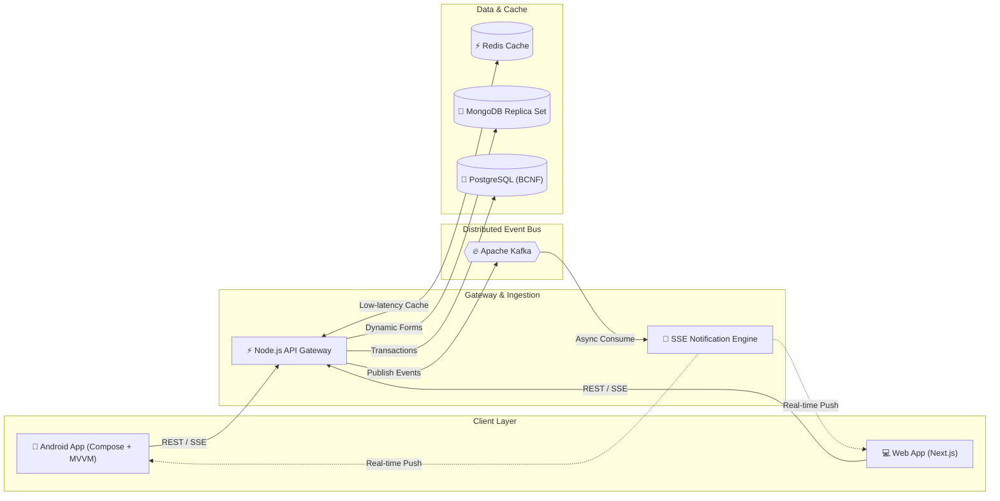

<div align="center">

# Neeraj Gautam
### Android & Distributed Systems Engineer · Fintech & Security Mindset

[](https://git.io/typing-svg)

<p align="center">
  <a href="https://www.linkedin.com/in/neeraj-gautam-b86188251"></a>
  <a href="mailto:gautamneeraj014@gmail.com"></a>
  
  
</p>

</div>

---

### ⚡ Executive Overview

I engineer high-throughput backend microservices and fluid, reactive Android applications. With a foundation in banking/fintech, my focus is on **data integrity, zero-trust security, and high-concurrency event-driven architecture**.

```bash
$ whoami --verbose
{
  "name": "Neeraj Gautam",
  "specialization": ["Android Architecture (Compose)", "Event-Driven Microservices (Kafka)"],
  "domain_experience": "Fintech & Banking Systems (Reliability, Compliance, BCNF Normalization)",
  "security_profile": "CPT Certified · Production CVE Patch Remediator (GHSA-9qr9-h5gf-34mp)",
  "developer_environment": "macOS M4 + Kali Linux (Pi 5) · Neovim (Lua, 50+ plugins) · Linux/Podman"
}
```

---

### 🧩 System Architecture in Action

*High-level overview of an enterprise event-driven architecture I've designed and deployed:*



---

### 🛠 Technical Arsenal

| Domain | Core Stack | Applied Focus |
| :--- | :--- | :--- |
| **Mobile Engineering** | **Kotlin**, **Jetpack Compose**, Coroutines, StateFlow, Retrofit | Clean Architecture, MVVM, 60fps UI, offline-first persistence |
| **Backend & Distributed** | **Node.js**, **Express**, **Kafka**, **Redis**, **SSE**, WebSockets | Event streaming, Pub/Sub, horizontal scaling, sub-50ms caching |
| **Databases** | **PostgreSQL**, **MongoDB**, **Prisma ORM** | BCNF normalization, replica sets, transaction guarantees |
| **DevOps & Infrastructure** | **Podman**, **Docker**, Linux, GitHub Actions CI/CD, Nginx | Containerized microservices, rootless containers, automated pipelines |
| **Security & Auditing** | **CPT Certified**, Kali Linux, Wireshark, Metasploit, DVWA | Production CVE remediation, threat modeling, attack surface reduction |
| **Dev Velocity** | **Neovim** (50+ Lua plugins), Tmux, Zsh, Git | Keyboard-driven workflow, zero GUI overhead, high output |

---

### 🚀 Featured Proof-of-Work

<details open>
<summary><b>🔥 DSA Mastery — Interactive Algorithm Visualizer (Open Source)</b></summary>
<br>

> Interactive educational platform visualizing 190+ data structures and algorithms with real-time canvas state machines.

- **Stack:** React · D3.js · Vite · GitHub Pages
- **Engineering Highlights:** Custom canvas animation pipeline, algorithmic step-by-step state machine, zero heavy UI framework dependencies.
- **Links:** [🌐 Live Demo](https://gautamneeraj88.github.io/dsa-mastery) · [💻 GitHub Repository](https://github.com/Gautamneeraj88/dsa-mastery)

</details>

<details>
<summary><b>🛡️ FormBuilder & Real-Time Engine — Distributed Platform (Enterprise)</b></summary>
<br>

> High-throughput dynamic form engine and notification service supporting enterprise clients.

- **Stack:** Node.js · Kafka · Redis · MongoDB Replica Set · Next.js · Podman
- **Engineering Highlights:**
  - Event-driven notifications orchestrated via Apache Kafka and RxJS over Server-Sent Events (SSE).
  - Remediated critical Remote Code Execution CVE (`GHSA-9qr9-h5gf-34mp`) in production Next.js dependencies.
  - Containerized and deployed with rootless Podman on enterprise servers.
- **Status:** `Office Work (Proprietary)`

</details>

<details>
<summary><b>📱 Bank On The Go — Modern Android Banking Application (Fintech)</b></summary>
<br>

> Mobile banking application built with modern Android guidelines, focusing on banking-grade security and instant transaction updates.

- **Stack:** Kotlin · Jetpack Compose · MVVM · Clean Architecture · PostgreSQL · SSE
- **Engineering Highlights:**
  - Unidirectional Data Flow (UDF) with Compose and Coroutines/StateFlow.
  - BCNF normalized schema via Prisma + PostgreSQL for strict transaction consistency.
  - Real-time balance and transaction push alerts via SSE.
- **Status:** `Office Work (Proprietary)`

</details>

<details>
<summary><b>⚡ Neovim Configuration — Ultimate Terminal Development Environment</b></summary>
<br>

> Fully modular Lua-based Neovim configuration built for blazing-fast full-stack and mobile development.

- **Stack:** Lua · Neovim 0.10+ · Treesitter · Mason · Telescope · LSP Zero
- **Features:** 50+ plugins, sub-40ms startup time, unified theme, customized keymaps.
- **Links:** [💻 GitHub Repository](https://github.com/Gautamneeraj88/nvim-config)

</details>

---

### 📈 Activity & Stats

<div align="center">


</div>

#### ⚡ Recent Activity
<!--START_SECTION:activity-->
<!--END_SECTION:activity-->

---

<div align="center">

```bash
$ echo "Let's connect: Android architecture · Distributed systems · Security research"
```

[](https://www.linkedin.com/in/neeraj-gautam-b86188251)
[](https://github.com/Gautamneeraj88)
[](mailto:gautamneeraj014@gmail.com)

```
neeraj@gautam:~$ █
```

</div>
